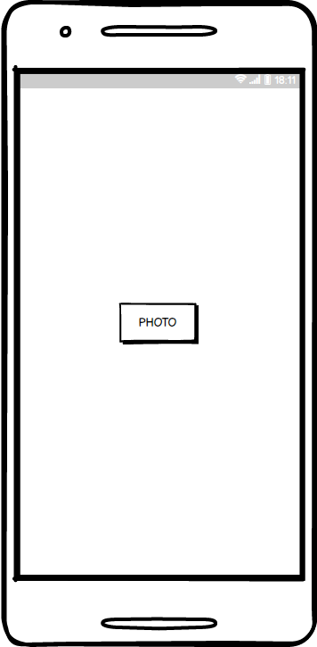
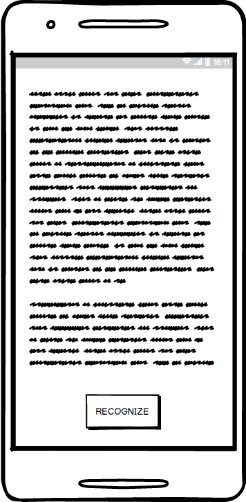
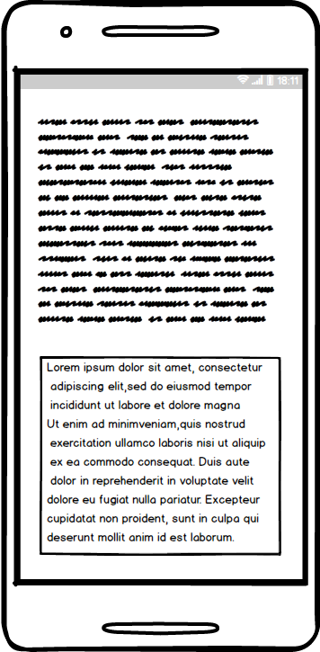

# **textlytic**

# Project requirements

## Content

1 [Introduction](#intro)  
2 [User requirements](#user_req)  
2.1 [Program interfaces](#prog_interf)  
2.2 [User interface](#ui)  
2.3 [User characteristics](#user_charact)  
2.3.1 [Application audience](#app_aud)  
3 [System requirements](#sys_req)  
3.1 [Functional requirements](#func_req)  
3.2 [Non-functional requirements](#nofunc_req)  
3.2.1 [Quality attributes](#qual_attr)  
3.2.1.1 [User convenience requirements](#user_conv_req)  
3.2.1.2 [Security requirements](#sec_req)  
3.2.2 [Restrictions](#restrict)  
4 [Analogues](#anal)

## Glossary
* TensorFlow - The core open source library to develop and train ML models.
* pandas is an open source, BSD-licensed library providing high-performance, easy-to-use data structures and data analysis tools for the Python programming language.
* Django - primary goal is to ease the creation of complex, database-driven websites.

<a name="intro"/>

## 1 Introduction
Project **textlytic** is utility application to  recognize text from photos.
There will be a server side that performs all the hard stuff
and application for mobile phones through which server will be accessed.
Photo taken -> sent to server -> recognized text appears.

<a name="user_req"/>

## 2  User requirements

<a name="prog_interf"/>

### 2.1  Program interfaces

Back-end side of project that represents neural network should be written on Python,
UI - Android + Kotlin/Java.

<a name="ui"/>

### 2.2 User interface   

* Photo uploading \

* Photo recognition \

* Apply result \

<a name="user_charact"/>

### 2.3 User characteristics

<a name="app_aud"/>

#### 2.3.1 Application auditory
Project is aimed on people who eager to delegate text recognition to the computer
or want to digitize text photos.

<a name="sys_req"/>

## 3 System requirements

<a name="func_req"/>

### 3.1 Functional requirements
User is able to:

| Functional | Requirement |
|:---|:---|
| Take photo | Take photo at the moment of using application |
| Pick photo | Choose existing photo from file system |
| Copy recognized text to clipboard | Save recognized text to clipboard to use it for some purposes |
| Save recognized text as text file | Persist recognized data to access it later |

<a name="nofunc_req"/>

### 3.2 Non-functional requirements

<a name="qual_attr"/>

#### 3.2.1 Quality attributes
The main evaluative criteria for this project is the quality of text recognition.
UI and speed of server access are important but they are not primary.

<a name="user_conv_req"/>

##### 3.2.1.1 User convenience requirements
* UI should be intuitive and comfortable.
* Server access should be fast enough to not spoil experience.
* Text recognition should be at a high level as a primary purpose of project.

<a name="sec_req"/>

##### 3.2.1.2 Security requirements
* Application should use HTTPS protocol for data transfer to establish secure connection.
* Bad words should not be recognized.

<a name="restrict"/>

#### 3.2.2 Restrictions
* Text recognition is not ideal due to neural networks limitations.
* Server performance may be lowered during simultaneous access.

## 4 Analogues
Microsoft Office Lens and Google.
