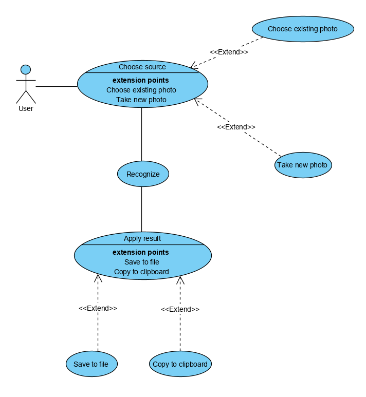
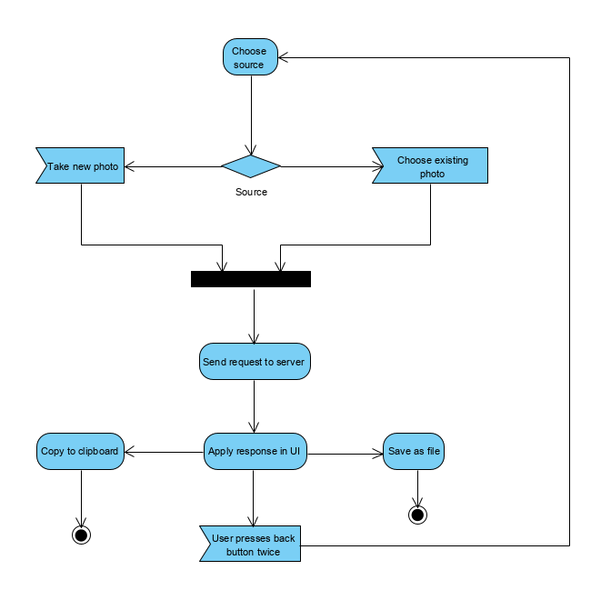
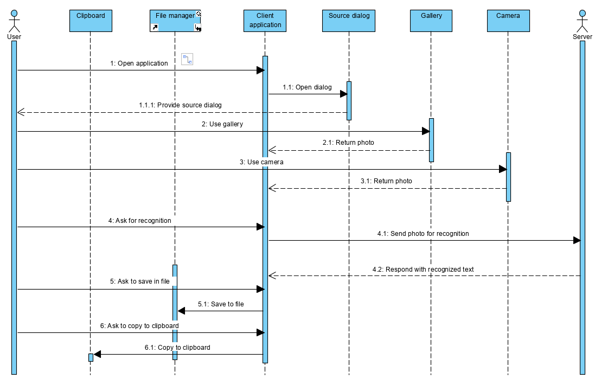
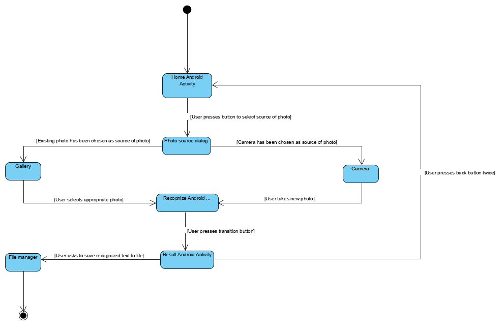
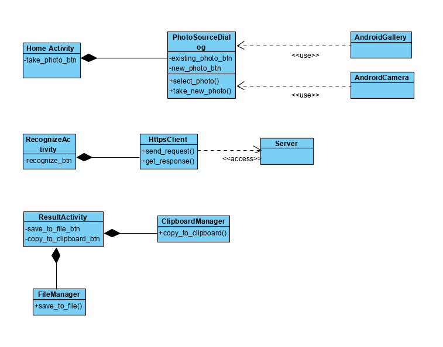
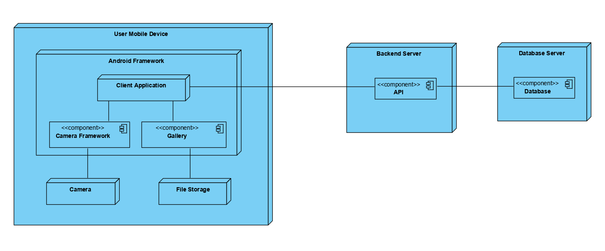

# **textlytic**

# System Design

## Content
1 [Use Case Diagram & Event Flow](#use_case_diagram_and_event_flow)\
1.1 [Actors](#actors)\
1.2 [Use Cases](#use_cases)\
1.2.1 [Choose source](#choose_source)\
1.2.2 [Choose existing photo](#choose_existing_photo)\
1.2.3 [Take new photo](#take_new_photo)\
1.2.4 [Recognize](#recognize)\
1.2.5 [Save to file](#save_to_file)\
1.2.6 [Copy to clipboard](#copy_to_clipboard)\
2 [Activity Diagram](#activity_diagram)\
3 [Sequence Diagram](#sequence_diagram)\
4 [State Machine Diagram](#state_machine_diagram)\
5 [Class Diagram](#class_diagram)\
6 [Deployment Digram](#deployment_diagram)

<a name="use_case_diagram_and_event_flow"/>

## 1 Use Case Diagram & Event Flow

## Use Case Diagram

## Event Flow

<a name="actors"/>

## 1.1 Actors

| Actor | Description |
|:--|:--|
| User | Target user of this application |

<a name="use_cases"/>

## 1.2 Use Cases

<a name="choose_source"/>

### 1.2.1 Choose source

**Description:** Use case 'Choose source' allows user to choose preferred way of providing photo for recognition.\
**Flow:**
1. Use case begins when user opens an application.
2. Application provides button to start working with application by selecting one of available sources of photo to recognize.
3. Available variants are: ['Choose existing photo'](#choose_existing_photo 'Choose existing photo') and ['Take new photo'](#take_new_photo "Take new photo").
4. Dialog with available variants would be provided.
5. Use case finished.

<a name="choose_existing_photo"/>

### 1.2.2 Choose existing photo

**Description:** Use case 'Choose existing photo' allows user to choose existing photo as source of recognition.\
**Prerequisites:** User has applied ['Choose source'](#choose_source 'Choose source').\
**Flow:**
1. Use case begins after applying use case ['Choose source'](#choose_source 'Choose source').
2. User selects photo from existing ones.
3. Application processes selected photo.
4. Use case finished.

<a name="take_new_photo"/>

### 1.2.3 Take new photo

**Description:** Use case 'Take new photo' allows user to take new photo to use it then as source of recognition.
**Prerequisites:** User has applied ['Choose source'](#choose_source 'Choose source').\
**Flow:**
1. Use case begins after applying use case ['Choose source'](#choose_source 'Choose source').
2. User takes photo using camera.
3. Application processes new photo.
4. Use case finished.

<a name="recognize"/>

### 1.2.4 Recognize

**Description:** Use case "Recognize" allows user to commit provided photo as source of recognition.
**Prerequisites:** User has applied ['Choose source'](#choose_source 'Choose source') and has chosen ['Choose existing photo'](#choose_existing_photo 'Choose existing photo') or ['Take new photo'](#take_new_photo "Take new photo").\
**Flow:**
1. Use case begins after applying use case ['Choose existing photo'](#choose_existing_photo 'Choose existing photo') or ['Take new photo'](#take_new_photo "Take new photo").
2. User commits provided photo for further usage as source of recognition by pressing a button.
3. Application (as a client) sends request to server.
4. Use case finished.

<a name="save_to_file"/>

## 1.2.5 Save to file

**Description:** Use case "Recognize" allows user to commit provided photo as source of recognition.
**Prerequisites:** User has applied ['Choose source'](#choose_source 'Choose source'), has chosen ['Choose existing photo'](#choose_existing_photo 'Choose existing photo') or ['Take new photo'](#take_new_photo "Take new photo") and has started ['recognition'](#recognize "Recognize").\
**Flow:**
1. Use case begins after applying use cases ['Choose source'](#choose_source 'Choose source'), ['Choose existing photo'](#choose_existing_photo 'Choose existing photo') or ['Take new photo'](#take_new_photo "Take new photo") and ['Recognize'](#recognize "Recognize").
2. Application has already received response from server with recognized text and has presented this text to user.
3. User presses button 'Save to file'.
4. Application handles action.
5. Application provides dialog or navigates to another Android Activity to save text to file.
6. Use case finished.

<a name="copy_to_clipboard"/>

## 1.2.6 Copy to clipboard

**Description:** Use case "Recognize" allows user to commit provided photo as source of recognition.
**Prerequisites:** User has applied ['Choose source'](#choose_source 'Choose source'), has chosen ['Choose existing photo'](#choose_existing_photo 'Choose existing photo') or ['Take new photo'](#take_new_photo "Take new photo") and has started ['recognition'](#recognize "Recognize").\
**Flow:**
1. Use case begins after applying use cases ['Choose source'](#choose_source 'Choose source'), ['Choose existing photo'](#choose_existing_photo 'Choose existing photo') or ['Take new photo'](#take_new_photo "Take new photo") and ['Recognize'](#recognize "Recognize").
2. Application has already received response from server with recognized text and has presented this text to user.
3. User presses button 'Copy to clipboard'.
4. Application handles action.
5. Application copies text to clipboard
6. Use case finished.

<a name="activity_diagram"/>

## 2 Activity Diagram

<a name="sequence_diagram"/>

## 3 Sequence Diagram

<a name="state_machine_diagram"/>

## 4 State Machine Diagram

<a name="class_diagram"/>

## 5 Class Diagram

<a name="deployment_diagram"/>

## 6 Deployment Diagram

